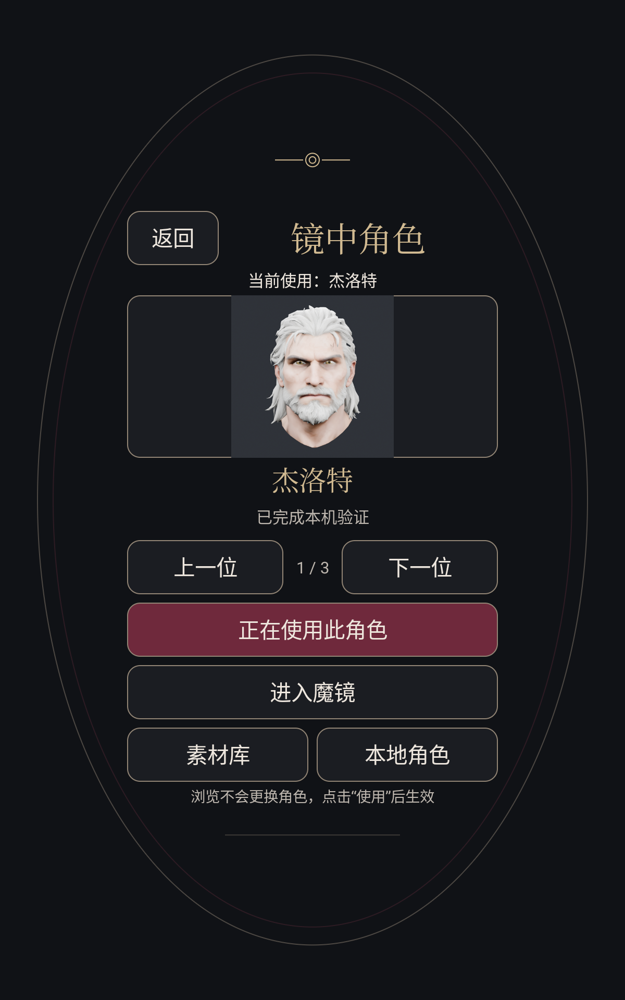
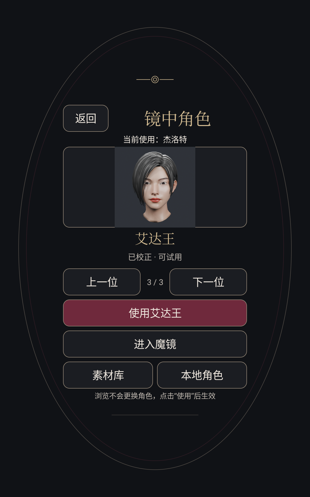

# V44 / 0.2.13：角色浏览页与材质专用着色器实验

本轮将长列表角色页改为一次浏览一个角色，完成真实设备选择/恢复/退出验证。全部原78个APK资产、9个native库和四份用户配置最终逐字节保持。性能候选得到有限域画面验证和同APK A/B/A短测，但仍保持默认关闭；普通入口不自动采用它。16+视点30呈现FPS、USB实时采集恢复、全部历史角色自然表情校正仍未完成。

## 角色页

集中显示缩略图、名称、校正状态、当前位置，以及实际正在使用的角色；上一位/下一位到边界时禁用。浏览不写设置，必须明确点击“使用”。已选角色显示“正在使用此角色”，进入魔镜使用保存的角色。素材库和本地导入入口保留，椭圆安全区内可滚动。

后台只解析目录和解码当前一张最多约512边长的缩略图，不加载GLB、相机、NPU或3D渲染。过期解码请求在执行前/回传后检查票据，旧位图替换释放；暂停/销毁拒绝旧回调。保存期间阻止重复保存及返回，保存失败重新读实际选择；从实时菜单进入时返回结果，由原运行重新读取角色，普通来源才新开运行。

实际设备验证了：三个角色翻页不改变四配置；边界控件；HOME、启动器Intent再Back回原页保留浏览位置；明确使用艾达王后强制停止/重开仍读到艾达王；进入运行首帧真正READY且模型身份为ada-wong；自然Back回首页；真实UI恢复杰洛特后四配置精确保持。启动器Intent本身会在旧角色页上方打开首页，不能描述成直接恢复角色页。

角色页/首页的Java线程列表由仅连接本地ADB转发的JDI采样确认，未见GLThread、avatar-pose、MirrorRuntime存活。早期按kernel ps名字判线程失败的记录保留；未把同名内核记录直接认作Java GLSurfaceView owner，也未凭该记录修改应用销毁逻辑。最终复测内核清单也无上述名称。这不表示GPU驻留内存归零。

## 材质专用着色器

新的AvatarBatchSpecializedGpu借用原合批VBO/IBO、UV、原PBR纹理和相同fit/world/normal/VP。每个材质把常量、unlit/textured/maps分支移到编译期，保留原PBR数学、采样、背面剔除和primitive/index顺序。Geralt7个draw entries归并成5种材质程序，single/OVR合计10个新增program，16视点从4次原合批调用变成28次分材质调用；不新增vertex/index/texture数据。调用数增加而片元路径简化，必须实际测，不能由代码行数推算收益。

仅显式debug `test_specialized_batch=true`启用，要求batched=true、固定Geralt模型SHA `9381f452c53098314f97e1a1799ec55d2be37878e66bf205c7a26958afcef531`，拒绝与ORM、fast-math、背景缓存、空白交织实验混用。普通默认false，其它角色不强行改后端；失败明确报错。单独SpecializedBatchCheckActivity也要求debug。

真机Mali-G52/GLES3.2在保存场景下完成69个确定性canonical姿态、每个16个400×640独立off-axis层，共1104层比较。每项只prepare上传一次，参考合批与候选共用姿态/纹理/原缓冲；候选末program实际绑定逐组检查。实际参考276次、候选1932次提交，10program/5材质。RGB最大差1/255，最大层RMSE0.0019764/255，351个RGB字节非零差，alpha零差；每个姿态两侧均16个不同视图hash。容差预先为maxRGB1/RMSE0.1/alpha0。结束后候选program释放，原路径恢复。此为有限69姿态软件绘制门，不证明所有连续表情、美术自然度或实体屏光学校准；阻塞readback时长不用于FPS。

## 同APK联合短测

完整原Geralt/PBR，录像NV21/RGA、RKNN478关键点及混合CPU/NPU52控制，同时16×400×640视点和1200×1920交织；persistentFBO与cached cameraVP相同，异步形变，目标31FPS。没有USB采集/解码，没有截图、JDI或GPU query干扰测量。按顺序原/候选/原各收集60秒，确认INTERACTIVE且完整面捕输入持续推进的呈现区间约44.4–44.8秒；三个完整采集和实际呈现证据门均true。

| 路径 | 实际呈现FPS | CPU整机四核均值 | GPU忙碌均值 | NPU忙碌均值 | PSS均值/峰值MiB |
|---|---:|---:|---:|---:|---:|
| 原合批第一次 | 8.9258 | 57.50% | 98.42% | 47.12% | 277.10 /395.55 |
| 分材质候选 | 11.2783 | 61.46% | 97.77% | 48.80% | 291.88 /398.08 |
| 原合批复测 | 8.9305 | 56.36% | 98.68% | 49.45% | 297.13 /405.11 |

相对两次原路径均值，候选短测约提升26.32%，但CPU约增加4–5个百分点、GPU仍接近满载。温度按顺序约62.2–66.9、66.3–71.1、70.6–73.3℃，无长时间稳定性结论。这里原对照是debug原合批，不是普通默认individual后端；正式自动启用前还应比较普通默认路径并做同姿态画面验证。

预注册前35秒辅助窗口FPS为8.8957/11.2442/8.8914，其完整35秒门三个均false，原样保留，未移动窗口获取通过。上表使用原collector定义的全部确认INTERACTIVE区间、不是把该辅助门说成true。最终安装SHA、四配置均精确保持；30FPS未达成。

## NPU与头部候选边界

只用既有RKNN Toolkit2 1.3编译并模拟了一个真实Geralt位移累加模型：58个已校正mesh权重→21,470个变化POSITION分量，base、rig、非线性smooth-normal/commit仍CPU。单MatMul实际为1个NPU Conv及2个CPU Reshape；RKNN2,756,028B，每姿态输出85,880B。72个实际生产Java参考姿态位置独立逐bit核对。FP16位移最大位置误差约15.85µm，但经原法线算法1842/1,248,408顶点样本偏差>1°、最坏117.58°，因此未接入APK、未做硬件吞吐测试或提高空转占用；不能把它说成GPU光栅/PBR的卸载。下一步先分解CPU位置/法线/commit真实成本，定位法线离群的可见性与数值稳定性。

萨菲罗斯眼睑局部候选仅改4个Blink P/N字段，372数组精确保留，新嘴型与其它控制保持。25个真实Java姿态无新增3D翻面，闭合漏点集合与源相同；厚折减少，但源继承的斜视/抬眉漏点仍存在，strict闭眼、完整技术/美术/设备/live/FPS全部未通过。候选仅保存在本地制作归档，不替换正式catalog或已发布的张嘴候选。

## 包与恢复

最终APK `AvatarRuntime-v44-role-browser-v2.apk` SHA256 `8e6a6f33ab693ebed2b274d0dc40da76230fb3afa4182a45086a4fa881f652a6`，版本0.2.13（44），原Android debug签名保持。该版是内部验证安装版；角色UI为产品入口，实验开关保持debug范围。离线构建、实际配置27项与旧PBR配置22项、专用shader/source和生命周期测试、独立只读复审通过。无需刷机、重启、清数据、root或更改ADB。

本地完整原始证据：`E:/tripo/output/mirror-program/20261007/v44-role-browser-v1`；低层冻结和审查：同日`v44-specialized-batch-v1`、`v44-specialized-peer-v3`；NPU仅主机原型：`v44-npu-deformation-v1`；眼部制作：`E:/tripo/output/mirror-assets/20261007/sephiroth-eye-correction-v1`。失败假设/初版APK/源码/冻结记录保留，未覆盖旧版本。源仓与公仓按本轮精确白名单同步，私人人脸录像和测试中间件不发布。