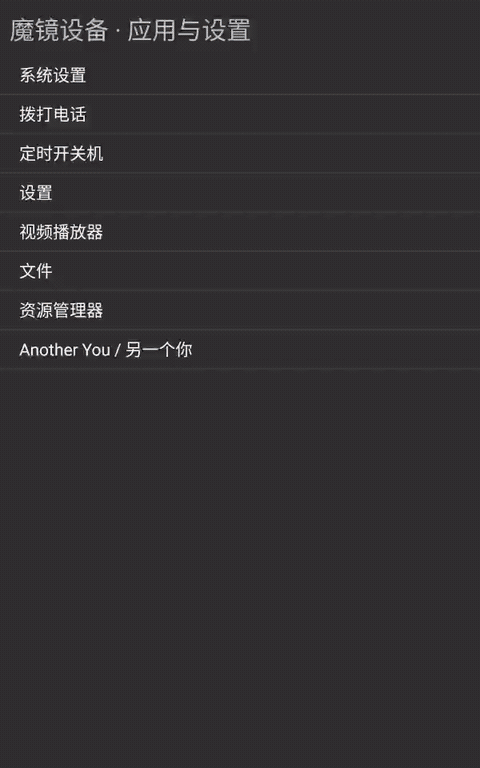

# V59 / 0.2.28：启动揭幕与原生页面动效

原有首页、角色和设置页主要为静态页面。本版沿用暗金、酒红与椭圆主题，补上短启动揭幕、页面打开/返回转场、按钮按压、角色与素材预览淡入，以及浮动弹窗转场。已安装到实际设备并输出真实录屏。

## 行为与范围

- 首次新建首页用 620ms 椭圆金线描边和品牌揭幕；恢复已有页面、保存状态重建或从历史任务返回时不重复揭幕。首次触摸先移除覆盖层，同一次事件继续交给原按钮；导航、保存和相机初始化不依赖动画结束回调。
- Activity 打开/关闭、任务打开/关闭、前后恢复及 wallpaper 槽显式配置纯 alpha，180～220ms；纯 UI 页面还有 0.992→1 的轻微内缩淡入。GLSurfaceView 及交织运行页不参加属性缩放或位移，保持像素交织位置。
- 按钮按下缩至 0.985，80ms；抬起或取消后 120ms 回到 1，仍使用原有原生涟漪、点击和无障碍行为。角色及素材当前图片解码成功后用 200ms 淡入与 0.975→1 缩放；清除或回收旧图片前取消动画。
- 浮动弹窗单独使用 180ms 内缩淡入、120ms 退出。原页面与弹窗尺寸仍在椭圆安全区内。页面暂停、移除或销毁时取消待运行回调、品牌绘制和属性动画，恢复 alpha/scale，注销生命周期监听。
- 尊重系统动画设置：API26 以上查询 ValueAnimator，较旧支持版本读系统动画倍率，窗口动画由系统对应倍率控制。关闭三项系统动画后，页面及弹窗仍可操作。没有持续粒子、模糊、背景循环动画或新的渲染引擎依赖。

模型、材质、表情映射、口腔、相机、NPU 与交织代码沿用 V58。仍有四个现有实时角色和 36 项素材，全部已打包资产保持原字节。本轮改动是 17 项 Java/资源/版本文件，另有本说明与 README；不把静态卡片预览称为新模型绑定校正。

## 实机验证

最终同签名 APK 以覆盖安装更新为 59 / 0.2.28。四份用户配置在安装与全部检查后均保持原字节，没有卸载、清数据、root、重启或刷机。

实际导航检查包括首页→角色→素材库→返回、角色前后浏览、设置与关于弹窗、首帧显示后立即点击、三轮快速进出、从桌面恢复原设置页并确认暂停后的弹窗已消失，以及系统关闭动画时的导航。76 项实际 SDK 编译/真实 Activity 回调测试通过；这组 host 测试覆盖编辑导航边界，不能代替实际动效或帧率测试。

启动预览使用 NEW_TASK / CLEAR_TASK 创建一次新的任务栈，仅清理任务导航状态，未清应用数据。实际录屏 1.2s 可见新椭圆揭幕，1.4s 揭幕淡出，1.6s 已为首页；这些是录屏时间，包含冷启动等待，并非动画从点击开始的固定延迟。

系统 Animator 原设置项缺省。关闭动画测试后，只删除键可能保留系统服务缓存中的零倍率；本轮先恢复有效默认倍率 1，再删除恢复缺省。最终不仅检查设置值，还在设备 `dumpsys window -a` 确认有效 Animator 为 1，窗口与转场倍率也恢复。最后停留首页，短静置两次采样的 UI 渲染帧计数保持 258，未持续重绘。

## 性能观察与限制

两轮短 UI 操作各包含角色前后预览、设置及弹窗，不录屏、不开相机、NPU 或 3D。正常动画：418 个采样帧，gfxinfo 中位 18ms、P90 61ms，janky 223/418；关闭动画对照：142 帧，中位 14ms、P90 93ms，janky 68/142。两组渲染帧数和工作量不同，不能据此声称持续 60fps 或全面不卡；首次页面创建和图片切换仍有长帧。录屏条件下的 gfxinfo 单独保留，未与不录屏数据混用。

本版没有新的实时 USB 面捕、NPU/GPU 联合负载、口腔绘制或 16+视点30FPS验收。历史证据与尚未完成的目标保留，不将 UI 预览文件的采样率当作渲染帧率。

## 交付与校验

- APK：`AvatarRuntime-v59-native-motion-v2.apk`，242,171,475 字节，SHA256 `5dc024c9396c1d7cc5b198ec878d42ba1e98d19c05c60bf4438f5e22cf90247b`。
- 签名证书 SHA256：`64a4af6baa9f10fd9d5bd09003ded7def368211604e3e91181bf015cdfbf6da8`，保持原证书。
- APK 中 99 个 assets 与 9 个原生库全部匹配 V58，资产覆盖数为 0，没有个人录像或诊断向量。
- 源父提交：`546479c11ba54ac4e1323de77ce90858438e3077`；公开父提交：`6604bbbd1e760dabbf635a23d6f816c127134ed7`。仅发布本轮 19 个源路径、27 个公开路径，保留原 180 项工作中内容、依赖、许可证、所有模型与历史文档。最终提交号以本轮同步终态为准。

[实际设备预览和来源](../review-assets/v59-native-motion-v1/README.md)：原 MP4 逐字节副本；GIF 为 20fps 时间采样与调色板量化，未合成动作帧；拼图只采用真实原帧和截图的等比例缩放。没有 AI 生成或改色。

