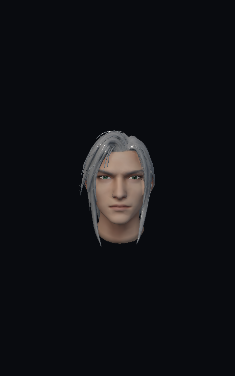

# 萨菲罗斯：张嘴下唇修正候选

本目录提供可编辑的 [GLB](character.glb)、[绑定清单](avatar.json) 和新模型实际设备预览。模型 SHA256 为 `d086ec755d554d87c261ed557cfa784b3aa4016277a71c230ebed6d5d5ce5484`；19,523 顶点、18,250 三角、8 个绘制项，原2K albedo/1K normal/1K ORM及其材质保持。

本轮只圆顺本角色张嘴下唇的方 U 轮廓，同步口腔附着及 jawOpen×mouthClose 补偿；没有改眼睛、眉毛、牙列、其它表情、索引、UV、原贴图。19＋61＋6实际 Java Rig/Deformer 姿态的有限技术门已通过，但不构成全角度、全部连续权重的几何证明。

新 SHA 已在 Mali-G52 上生成10张原生产 PBR 截图，并完成九姿态×16独立层的串行/OVR与逐项/合批比较。详见 [设备检查摘要](device-validation.json)。这些检查证明渲染路径通过；不包含实时摄像头、物理屏光学效果、帧率或美术验收。

候选尚未接入正式角色库或打进 APK：原眼睑厚折、下唇高光、口角和发丝材质仍需改良。`artwork_accepted=false`、`formal_integrated=false`。原角色源与失败候选均在本地冻结档案保留，详细制作源码归档 SHA 为 `13069da55f00637352e8e7158e0dfe10a823d9f219dcd5e734da1b5a59bfbb6a`；该大型制作归档不在本目录。
