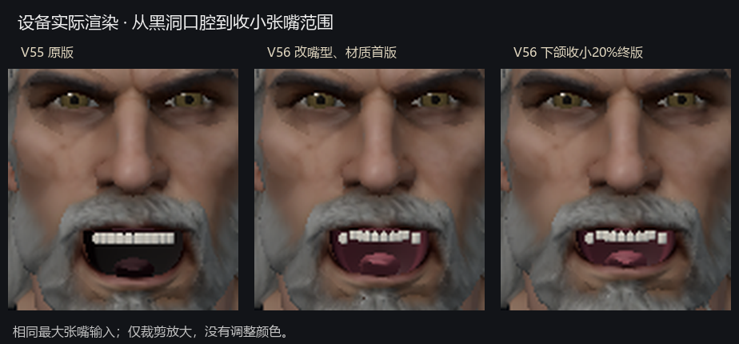
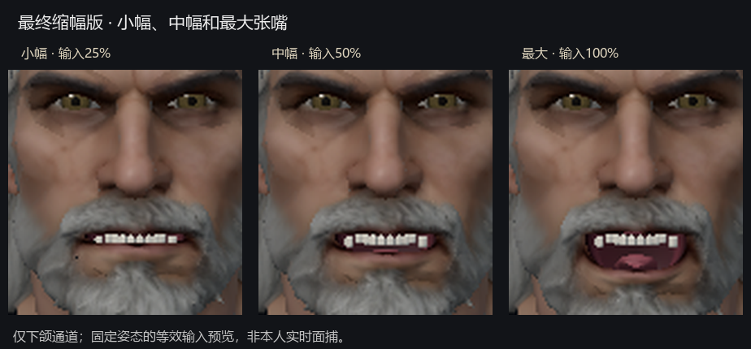

# V56 最终嘴部预览

两图使用五张独立设备 Mali PNG，共六个展示格。只等比例裁剪放大，未改色或生成画面。第一图依次为 V55、缩幅前 V56 v1、最终缩幅 V56 v2；第二图为最终版本的下颌输入 25%、50%、100%。25%/50% 用三个同步下颌参数等效缩放的私有诊断 manifest 获取，不修改正式角色或设置。

最终 APK 的下颌贡献缩小 20%，微笑与眉眼保持。口腔仍简化，没有真人面捕、光学3D或帧率结论。

