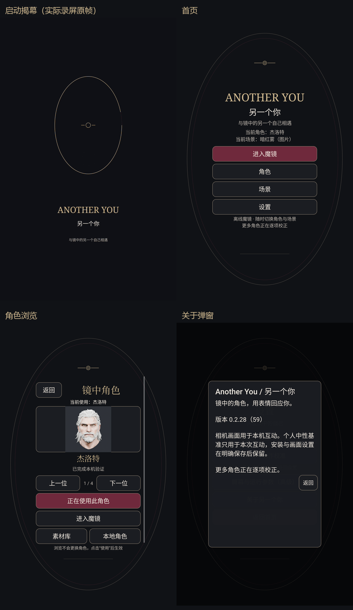

# V59 实际启动与页面动效预览

本目录来自设备上的 V59 / 0.2.28，APK SHA256 `5dc024c9396c1d7cc5b198ec878d42ba1e98d19c05c60bf4438f5e22cf90247b`。

`ui-motion-device.mp4` 是 Android 原始录屏的逐字节副本，包含首次启动的暗底标志、椭圆描边揭幕、首页、角色前后浏览、设置和关于弹窗。为显示一次真正的新启动，清除的是已有任务栈，未清除应用数据；系统有效动画倍率为 1，窗口/转场倍率保持原 0.5。

GIF 对实际录屏按 20fps 时间采样，等比例缩为 480×768 并进行 GIF 调色板量化；没有补算动作帧。20fps 是预览文件的采样率，不是面捕或交织帧率。拼图采用录屏 1.20s 的原帧和三张实机截图，只加说明、等比例缩放，没有生成或改色。

UI 短测不同时运行相机、NPU 和 3D。正常动画 418 个采样帧，gfxinfo 中位 18ms、P90 61ms、janky 223/418；关闭动画对照为 142 帧，中位 14ms、P90 93ms、janky 68/142。短测包含页面创建及缩略图切换，两组帧数不同，不能据此声称持续 60fps、全面不卡或交织性能提升。功能导航、快速返回、后台恢复、系统关闭动画均已检查；原用户配置、设置值及有效 Animator 默认值已恢复。

源文件与派生参数见 [provenance.json](provenance.json)。
