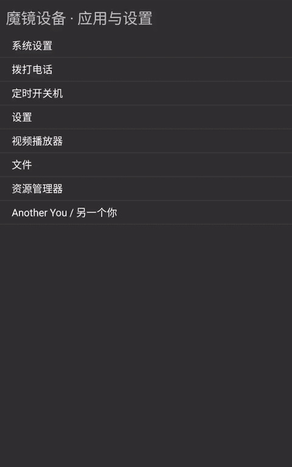
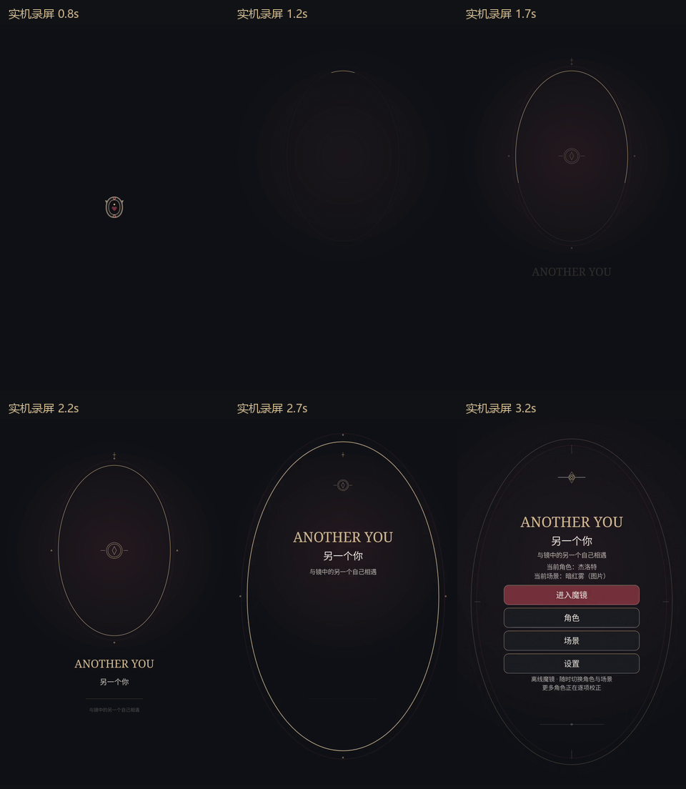
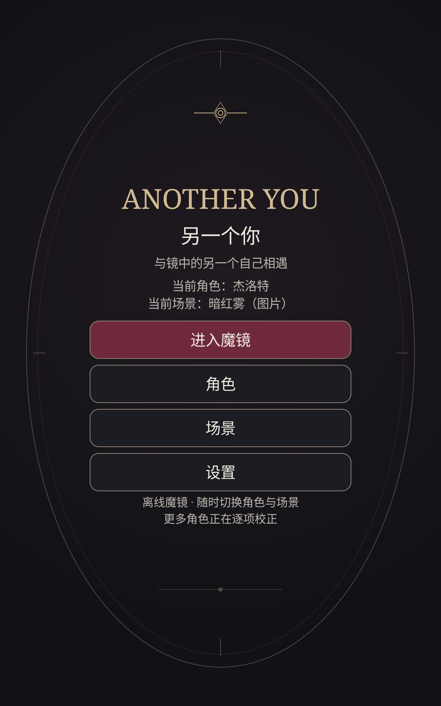

# V60 实际设备动效预览

这组文件来自 2026-10-10 RK3566 设备上 V60 / 0.2.29 的真实 UI 录屏，保持原系统动画倍率。内容为启动揭幕、角色浏览、设置与关于弹窗，不包含相机画面。

[高清原始录屏](ui-motion-device.mp4) · [来源与文件哈希](provenance.json)

MP4 为原录屏逐字节副本；GIF 使用 20fps 时间采样与调色板量化，不改变播放速度，不补帧、不合成动作、不改色。拼图仅对原帧等比例缩放并加时间标签。20fps 是 GIF 导出设置，不是应用帧率。录屏包含冷启动等待，2.1 秒指应用启动动画本身。
